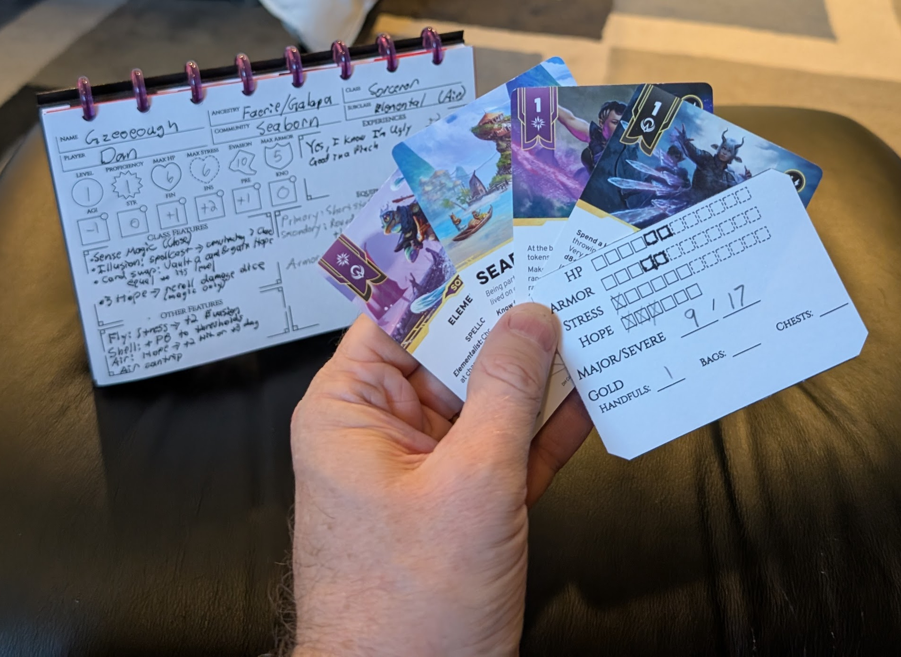

A US Half-Letter (5.5" x 8.5") Daggerheart character sheet, suitable for use in a disc-bound notebook.

## Design Philosophy of This Character Sheet

While primarily a TTRPG, Daggerheart incorporates a few boardgame elements, notably in its use of a
card idiom for feats, spells, etc. These cards are of the typical 2.5" x 3.5" size. The intent seems
to be for players to be able to keep relevant cards right at hand, so as to not have to constantly
reference the rulebook proper for this like spell descriptions.

This character sheet leans in to that conceit. Accordingly, there are two elements:

1. [charsheet.html](charsheet.html) is a generic (non-class-specific[1] ), two-sided character sheet
   that records the static and mostly-static (infrequently changing) elements of a character.
2. [tracker-cards.html](tracker-cards.html) is a grid of 9 2.5" x 3.5" cards that record the dynamic
   (frequently changing) elements of a character.

The intention is that players prepare the character sheet and keep it handy to refer to. They will
then also prepare a tracker card, which is held and used along with the various Domain and other
cards to record Hope/Stress/HP/Armor/etc. as the game progresses. In this way, the bookkeeping for a
character is moved out of the character sheet and into a card. This means that the very large
majority of player time should be spent with the cards, with only an occasional need to refer back
to the actual character sheet.

That's the intent, anyway. The reader may decide if the intent is realized.

[1] - the character sheet is not class-specific because I don't like the SRD license for Daggerheart
and don't want to agree to it to be able to lift the class text from it. Plus, embedding the class
text would mean needing a separate `.html` file for every class, and I prefer to keep things simple.

## Usage

To use:

1. `git clone` the repo, or even just download `charsheet.html` and the `assets/` directory
2. Open the file in a browser, via a `file:///` URL
3. Print the HTML page (ctrl-P)

Alternatively, if you don't want to make any tweaks, just download and print
[charsheet.pdf](pdf/charsheet.pdf) and [tracker-cards.pdf](pdf/tracker-cards.pdf).

## Card Holders for Discbound Notebooks - 3D Model

Since Daggerheart is card-based, it is helpful to keep those cards a given character is using
with that character's sheet. Since this project is about compact half-letter notebooks, then, it
follows that a half-letter, discbound-compatible card-holder would be useful.

So I made [this 3D
model](https://cad.onshape.com/documents/d331147663dd69d3663dd930/w/7be3bbca73f4233c333e50fd/e/643410635efd1b640a4e74b4?renderMode=0&uiState=686894d1e1723828ff52d3ab)
for a simple 2.5" x 3.5" flexible card holder that is compatible
with discbound notebooks. It will hold 3 cards, so a given character will need several of them to
hold all relevant cards.

## Other 3D Models

Besides the above, I have also made a few other 3D models for disc-bound notebooks.

[This 2mm-thick back
plate](https://cad.onshape.com/documents/5505ea7329ec1e8cba2426c4/w/84436b9c585ca8cf7dc2e4ac/e/3d3145a5980725337754c8cd)
prints up as a very solid writing surface, comparable to using a clipboard. It will fight you a
little bit when you try to add the discs, but once they're in it grips them "just right" so that
they don't flop around much, while still allowing pages to turn easily.

[This 0.75mm-thick
cover](https://cad.onshape.com/documents/f8f661f421c548fc65ea0b26/w/8aaffb41f5c480bc764f2828/e/06d77aec9bf6c64a84fcb9c2)
is a version of the back plate above, but at 0.75mm thick. When printed, this will be stiff but
flexible, making for a decent protective cover.

[This horizontal
bookmark](https://cad.onshape.com/documents/17570db548acda438b8d99d4/w/8ee36746cc3cfb89cfcfb844/e/2e9c309bc402fce69fa6f012)
sits on two adjacent discs and extends out ~5mm past the page edge. This is essentially like a
tabbed divider page, but in a bookmark-style form factor.

## Putting it All Together

The overall idea here is:

1. Print the character sheet and tracker cards on light cardstock (or just regular paper), and cut into
   individual sheets/cards
2. 3D print a couple card holders (above)
3. 3D print a backplate and cover for the notebook (above)
4. Buy some discbound discs and pre-punched lined/graph discbound paper (Amazon is swimming with these)
5. Assemble a notebook that contains your character sheet, the Daggerheart cards you use, a new handy
   stat-tracking card, and some paper for note-taking

